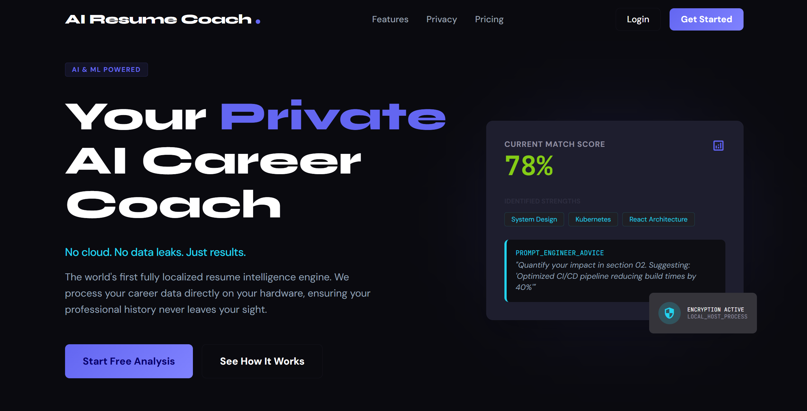
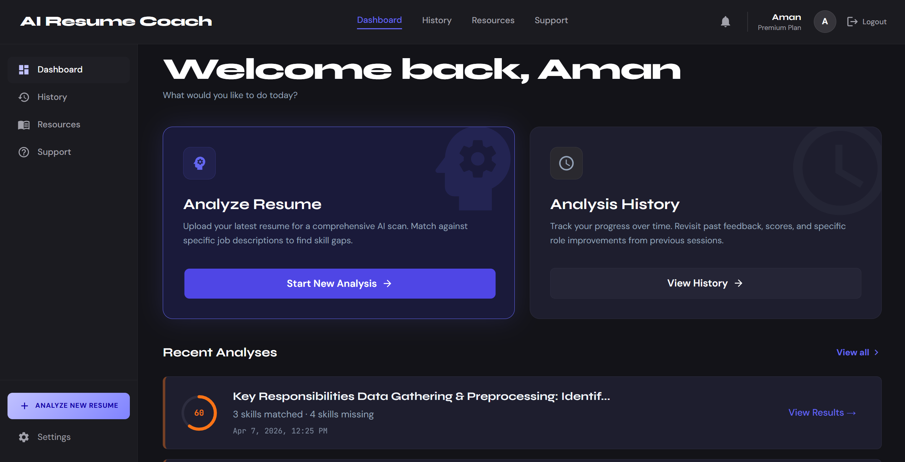
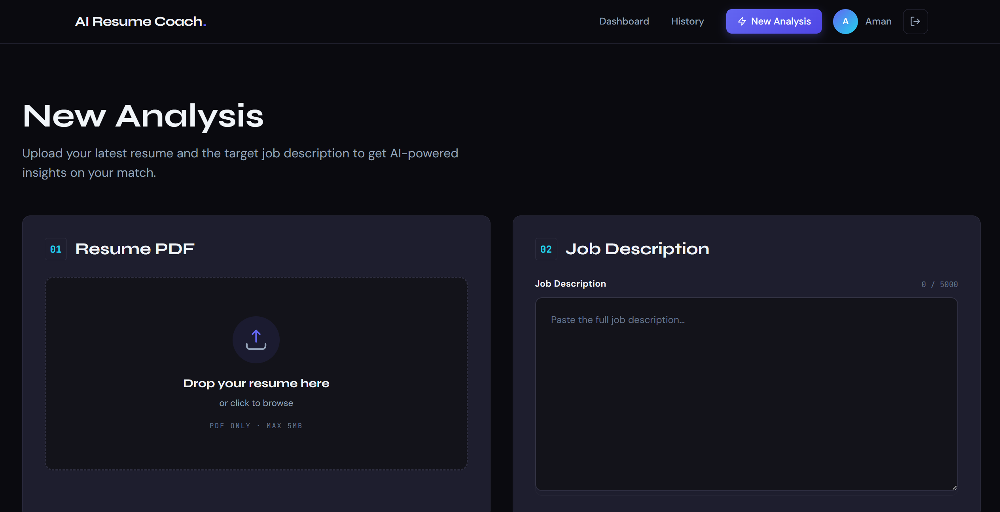
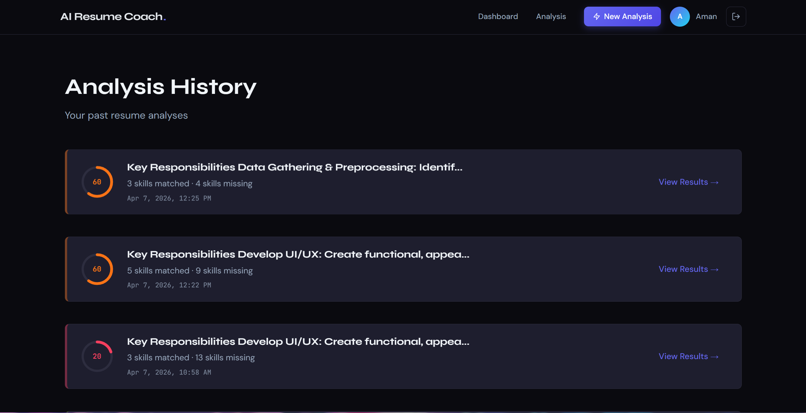

# AI Resume Coach



**AI Resume Coach** is a full-stack, enterprise-grade web application built to analyze and elevate developer and professional resumes using modern AI models. It provides deep ATS compatibility scoring, skill gap identification, STAR-method bullet point rewrites, custom interview preparation questions, and personalized learning roadmaps.

---

## 🌟 Key Features

### 🔐 Authentication & Identity Security
- **Dual Authentication Modes**: Supports both standard Email/Password JWT authentication and **Google OAuth 2.0**.
- **Google OAuth Claim Verification**: Strictly verifies `email_verified` claims and Google token signatures on the backend.
- **Automated Account Linking**: Seamlessly links Google identity to pre-existing email/password accounts without creating duplicate user records.

### 🤖 Provider-Agnostic AI Engine
- **Multi-Provider Support**: Supports both **Google Gemini** (`@google/genai`) cloud models (`gemini-flash-latest`, etc.) and local **Ollama** LLMs (`mistral`, `llama3`, `codellama`).
- **User-Selectable Provider & Model**: Switch between cloud AI or 100% private, on-device local execution anytime.
- **Provider Resilience & Validation**: Enforces structured JSON output schema validation with explicit error handling — **No Silent Provider Fallbacks**.

### 📊 Deep Resume Insights & PDF Reports
- **ATS Match Score**: Detailed percentage match breakdown with matched skills, missing skills, and experience evaluation.
- **STAR-Method Bullet Improver**: Tailored AI suggestions to rewrite weak resume bullet points into high-impact accomplishments.
- **Custom Interview Q&A Generator**: Generates targeted interview questions based on the candidate's specific job description gaps.
- **Personalized Skill Roadmap**: Actionable week-by-week learning plan with priority ratings to bridge skill gaps.
- **Zero-AI PDF Export**: Dedicated printable report viewer and instant PDF export reading stored analysis JSON without triggering redundant AI API calls.

### 🛡️ Production Security & Hardening (Phase 6)
- **File Upload Security**: Enforces 5 MB limit at the multipart boundary and verifies `%PDF` magic bytes to block file extension spoofing.
- **Rate Limiting & Abuse Prevention**: Sliding-window rate limiters protecting `/api/auth/register`, `/login`, `/google` (10 req / 15 min) and `/api/analysis/run` (5 runs / 10 min).
- **Strict Data Isolation**: All database queries are strictly scoped to `user_id: req.user.id` with ObjectId validation to prevent cross-tenant data leaks and injection attacks.
- **Security Headers & CORS**: Production-hardened with `helmet` headers and environment-controlled CORS origin policies.

---

## 🖼️ Screenshots

| Landing Page | Dashboard |
|---|---|
|  |  |

| New Analysis | Analysis History |
|---|---|
|  |  |

### Comprehensive Report View


---

## 🏗️ Architecture & Data Flow

```
[User / Browser (React + Vite)]
            │
            ├─ 1. Authenticate (JWT / Google OAuth ID Token)
            ├─ 2. Upload PDF Resume + Job Description
            ▼
[Express 5 Server]
            │
            ├─ 3. Multer (5 MB boundary) + %PDF Magic Byte Validation
            ├─ 4. PDF Text Extraction (pdf-parse v2)
            ├─ 5. ProviderFactory (Selects Gemini or Ollama)
            ▼
[AI Engine (Gemini / Ollama)]
            │
            ├─ 6. Prompt Engineering & JSON Schema Enforcement
            ├─ 7. Generate ATS Score, Skill Gaps, Bullets, Interview Qs & Roadmap
            ▼
[Express 5 Server]
            │
            ├─ 8. Validate Schema & Save Document to MongoDB (Scoped to User ID)
            ▼
[User / Browser] ◄─── 9. Render Interactive Report & Zero-AI PDF Export
```

---

## 🛠️ Tech Stack

### Frontend (Client)
- **Framework**: [React 19](https://react.dev/) with [Vite](https://vitejs.dev/)
- **Styling**: [Tailwind CSS v4](https://tailwindcss.com/)
- **Routing**: [React Router v7](https://reactrouter.com/)
- **State Management**: [Zustand](https://docs.pmnd.rs/zustand/)
- **OAuth**: `@react-oauth/google`
- **HTTP Client**: Axios
- **Icons & Toast**: React Icons & React Hot Toast

### Backend (Server)
- **Runtime**: Node.js (v18+)
- **Framework**: Express.js (v5)
- **Database**: MongoDB via Mongoose (v9)
- **AI SDKs**: Google GenAI (`@google/genai`) & Ollama API
- **Auth**: Google Auth Library (`google-auth-library`), JWT (`jsonwebtoken`), and `bcrypt`
- **PDF Extraction**: `pdf-parse` (v2) & `multer`
- **Security & Utilities**: `helmet`, `cors`, custom sliding-window rate limiters
- **Testing**: Jest 30 & Supertest (13 test suites, 159 passing unit/integration tests)

---

## 🚀 Getting Started

### Prerequisites
- **Node.js**: v18.0.0 or higher
- **MongoDB**: Local MongoDB instance or MongoDB Atlas cluster
- **Google OAuth Client ID** *(Optional for Google Sign-In)*
- **Google Gemini API Key** *(Optional for Gemini provider)*
- **[Ollama](https://ollama.com/)** *(Optional for local AI execution: `ollama pull mistral`)*

---

### Environment Setup

#### 1. Server Environment (`server/.env`)
Create a `.env` file in the `server` directory:
```env
PORT=5000
NODE_ENV=development
MONGO_URI=mongodb://localhost:27017/ai-resume-coach
JWT_SECRET=your_super_secret_jwt_key
GOOGLE_CLIENT_ID=your_google_client_id.apps.googleusercontent.com
GEMINI_API_KEY=your_gemini_api_key
OLLAMA_URL=http://localhost:11434
CLIENT_URL=http://localhost:5173
```

#### 2. Client Environment (`client/.env`)
Create a `.env` file in the `client` directory:
```env
VITE_API_URL=http://localhost:5000/api
VITE_GOOGLE_CLIENT_ID=your_google_client_id.apps.googleusercontent.com
```

---

### Installation & Launch

1. **Clone the repository:**
   ```bash
   git clone https://github.com/your-username/ai-resume-coach.git
   cd ai-resume-coach
   ```

2. **Setup and Start Server:**
   ```bash
   cd server
   npm install
   npm run dev
   ```

3. **Setup and Start Client:**
   ```bash
   cd ../client
   npm install
   npm run dev
   ```

4. **Access Application:**
   Open your browser at `http://localhost:5173`.

---

## 🧪 Testing & Verification

The project contains a comprehensive automated test suite covering authentication, security, AI provider resilience, upload validation, database isolation, rate limiting, and zero-AI PDF exports.

### Run Backend Tests:
```bash
cd server
npm test
```
*Executes all 13 Jest test suites sequentially (`--runInBand`) with code coverage reporting.*

### Run Frontend Linting:
```bash
cd client
npm run lint
```
*Verifies 0 ESLint errors and 0 warnings.*

### Build Frontend Production Bundle:
```bash
cd client
npm run build
```

---

## 📄 License

This project is open-source software licensed under the MIT License.
